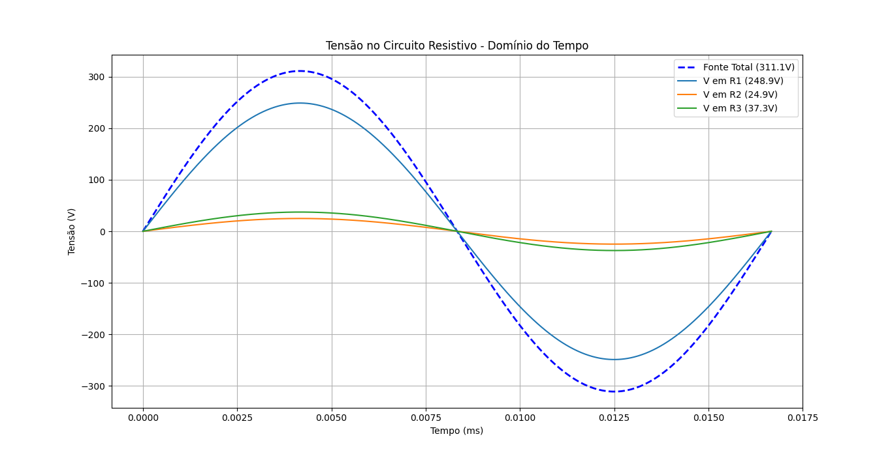
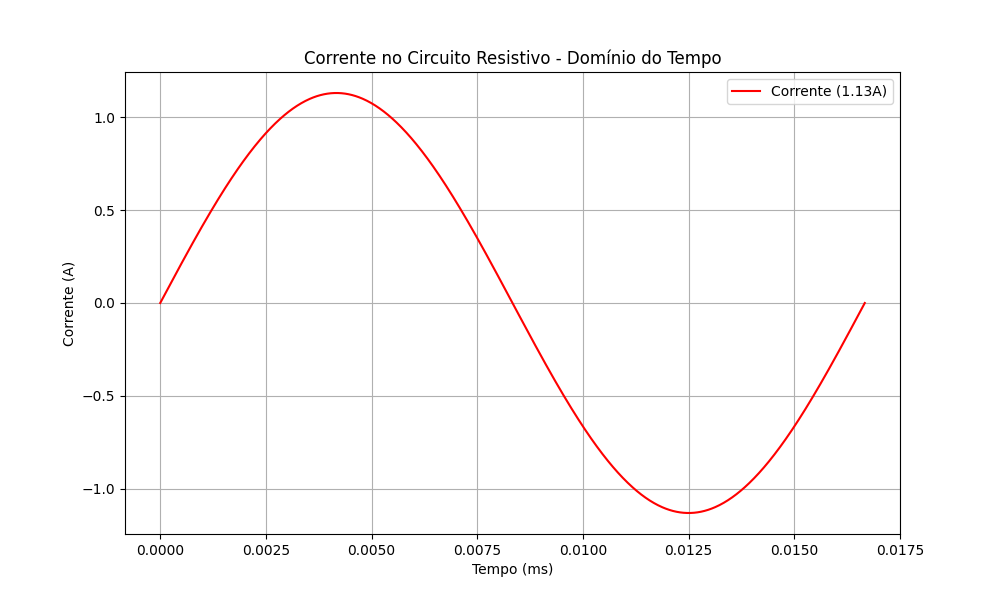
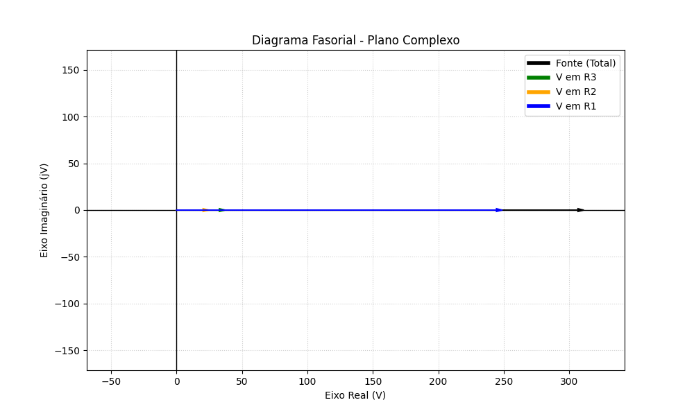

# Circuitos-Eletricos
---

---
# Equações que descrevem o circuito

Assumindo uma fonte senoida do tipo:

$$
V_{fonte}(t) = V \cdot \cos(\omega \cdot t)
$$

A resolução do circuito é dada por:

$$
U_{fonte} = U_{R1} + U_{R2} + U_{R3} 
$$
$$
U_{fonte} = i \cdot R_{1} + i \cdot R_{2} + i \cdot R_{3} 
$$
$$
U_{fonte} = i \cdot [R_{1} + R_{2} + R_{3}] 
$$
$$
i = \frac{U_{fonte}}{R_{1} + R_{2} + R_{3}}
$$

Com os valores dado na tabela abaixo temos:

| Componente | Valor | Unidade |
| :--- | :---: | ---: |
| $R_{1}$ | 220.0 | $\Omega$ |
| $R_{2}$ | 22.0 | $\Omega$ |
| $R_{3}$ | 33.0 | $\Omega$ |

Teremos os seguintes resultados mostrados nos graficos abaixo

